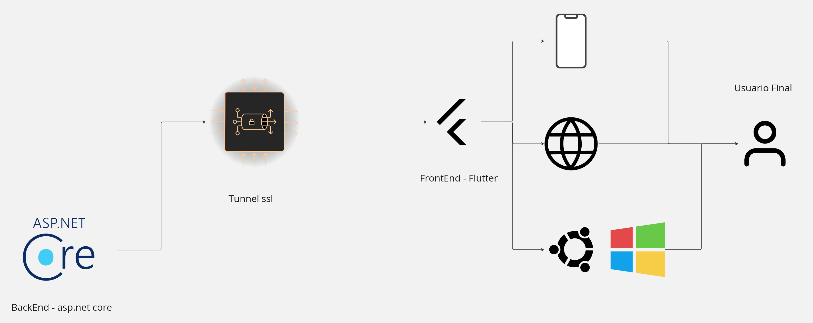

# Proyecto de Gestión de Tareas - Flutter

Este proyecto es una aplicación de gestión de tareas desarrollada en Flutter, que permite a los usuarios crear, completar, y eliminar tareas, así como ver estadísticas en tiempo real. La aplicación se conecta a un backend desarrollado en ASP.NET Core mediante WebSocket para actualizar las estadísticas de forma dinámica.

## Descripción General

Esta aplicación de gestión de tareas ofrece las siguientes funcionalidades:
- Crear nuevas tareas.
- Completar y eliminar tareas.
- Visualizar estadísticas de tareas (completadas, no completadas, eliminadas) en un gráfico de pastel.
- Comunicación en tiempo real con el backend para actualizar estadísticas usando WebSocket.

## Arquitectura

La arquitectura de la aplicación está diseñada para facilitar la conexión entre el frontend en Flutter y el backend en ASP.NET Core, proporcionando actualizaciones en tiempo real mediante SignalR. A continuación se muestra un diagrama de la arquitectura utilizada:




## Generación de la Documentación

La documentación técnica de este proyecto ha sido generada automáticamente con `dartdoc`. Para visualizarla, sigue estos pasos según tu sistema operativo:

- **Linux**:
  ```bash
  xdg-open doc/api/index.html
